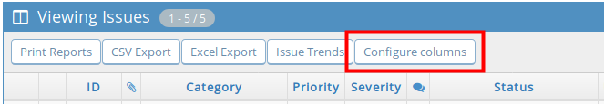
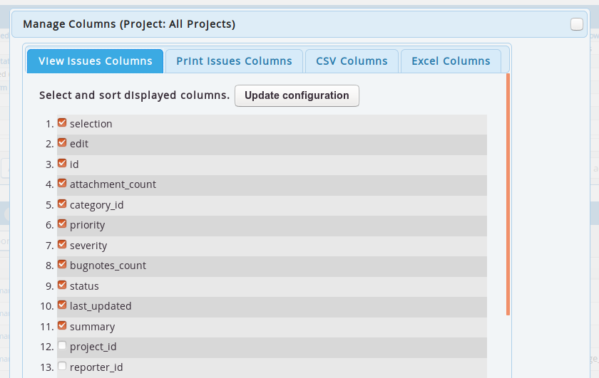
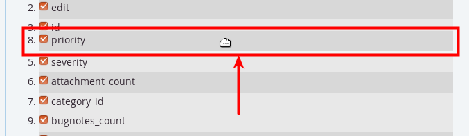
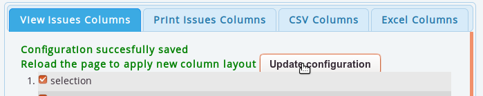

# Inline Column Configuration plugin for MantisBT

Copyright (c) 2011  Robert Munteanu - robert@lmn.ro  
Copyright (c) 2015  Carlos Proensa

Released under the [GNU GPL v2 licence](http://opensource.org/licenses/GPL-2.0)

For further details, please refer to the [plugin's page](https://www.mantisbt.org/wiki/doku.php/mantisbt:inlinecolumnconfiguration)
in the MantisBT wiki.

See [Changelog](https://github.com/mantisbt-plugins/InlineColumnConfiguration/blob/master/CHANGELOG.md).

## Description

The InlineColumnConfiguration allows you to configure the column preferences 
inline, in the view bugs page, instead of going through the _Manage Columns_
page in user preferences.

## Requirements

The plugin requires 

  * [MantisBT](http://mantisbt.org/) version 2.2 or higher
  * [jQueryUI plugin](https://github.com/mantisbt-plugins/jQuery-UI) 
    version 1.8 or higher

If you are running MantisBT 1.x, please use 
[Version 1.2.0](https://github.com/mantisbt-plugins/InlineColumnConfiguration/tree/v1.2.0).

## Installation

1. Download the plugin's [latest release](https://github.com/mantisbt-plugins/InlineColumnConfiguration/releases/latest) 
   or clone the [source code](https://github.com/mantisbt-plugins/InlineColumnConfiguration).
2. Copy or link the plugin (the `InlineColumnConfiguration/` directory) into your Mantis
   installation's `plugins/` directory.
3. While logged into your Mantis installation as an administrator, go to
   *Manage -> Manage Plugins*.
4. In the *Available Plugins* list, you'll find the *InlineColumnConfiguration* 
   plugin; click the **Install** link.

## Usage

The plugin adds a *Configure columns* menu item to the View issues page.

When clicked, a configuration pop-up dialog opens, allowing users to select
which fields to display for _View_, _Print_, _CSV_ and _Excel_ columns. 

Drag and drop columns to control the order in which they are displayed.

Click on the _Update Configuration_ button to save changes.

## Support

The latest source code can found on
[Github](https://github.com/mantisbt-plugins/InlineColumnConfiguration).

We encourage you to submit Bug reports and enhancements requests on the
[MantisBT issues tracker, under the *Plugin - InlineColumnConfiguration* project](https://www.mantisbt.org/bugs/view_all_bug_page.php?project_id=14).
If you would like to propose a patch, do not hesitate to submit a new
[Pull Request](https://github.com/mantisbt-plugins/InlineColumnConfiguration/compare/).
